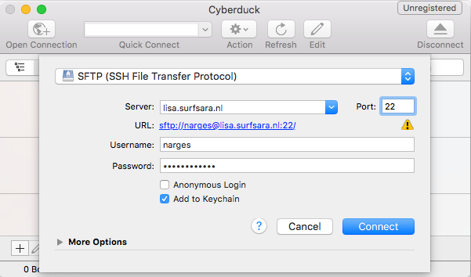
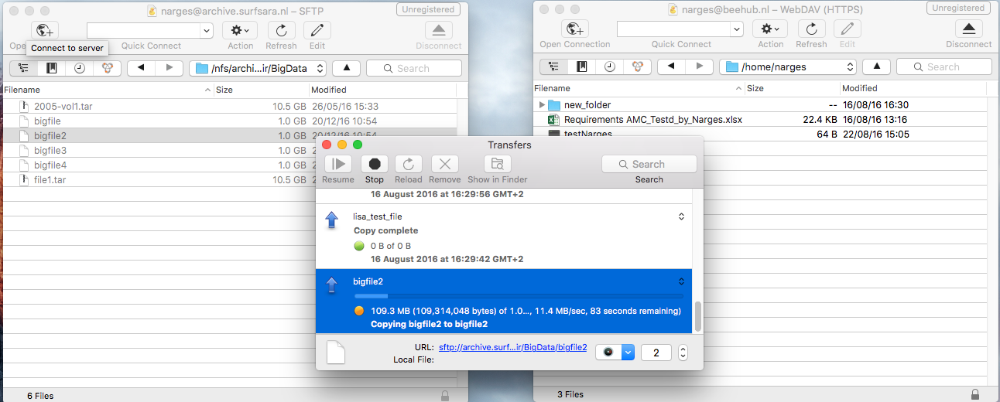

#Demo: Archive usage via GUI
To transfer data to the Archive you first need to install Cyberduck (Mac & Windows) or Filezilla (Linux). 
In this manual we use Cyberduck to transfer data to/from the archive. Cyberduck is an open source client that supports FTP and SFTP, WebDAV availble for macOS and Windows. Before transferring data you first need to download and install the software. 

- Go to **http://cyberduck.io/**
- Download the software for your machine (Windown or Mac) 
- Install and Open Cyberduck
 
For linux systems, you can download and install FileZilla from: 

- https://filezilla-project.org/
 

## Access Archive
To access Archive via Cyberduck:

1. Start cyberduck
2. Click on 'Open Connection'. You now see the following screen:

3. Choose the following options:
	- Connection type (at the top of the screen): **SFTP (SSH file transfer protocol)**
	- Server: **archive.surfsara.nl** 
	- Port **22** 
	- Enter your user name (sdemo<0XX>) and password
	- Do not enable 'Anonymous Login'
	- Enabling 'Add to Keychain' lets the program remember your settings. Whether you want this is up to you.
	- Click on 'connect'

After connecting you will see the files in your archive home account. 

- Try transferring files to the archive by simply drag and drop files from your computer to Cyberduck connection session. Try downloading files from the archive to your computer.

Note: If the data is on tape, it first needs to be staged before it can be used. If the data is not staged, Cyberduck can't access the data the connection will be timed-out (and you will receive a Broken-pipe Exception). Therefore Cyberduck is better for dumping data into the archive, rather than fetching data.

## Access Other Services
You can connect to other services such as Lisa, cartesius, or Beehub via Cyberduck. 

###Access Lisa
To access Lisa via Cyberduck: 

1. Open a new Cyberduck window (Ctrl+N)
2. Click on 'Open Connection'
3. Choose the following options:
	- Connection type (at the top of the screen): **SFTP (SSH file transfer protocol)**
	- Server: **lisa.surfsara.nl** 
	- Port **22** 
	- Enter your user name and password
	- Do not enable 'Anonymous Login'
	- Enabling 'Add to Keychain' lets the program remember your settings. Whether you want this is up to you.
	- Click on 'connect'

###Access BeeHub
To open a BeeHub session with Cyberduck:

1. Open a new Cyberduck window (Ctrl+N)
2. Click on 'Open Connection'
3. Choose the following options:
	- Connection type (at the top of the screen): **WebDAV(HTTP/SSL)**
	- Server: **beehub.nl**
	- Port **433**
	- Enter your BeeHub username and password as you use them on the website 
	- Do not enable 'Anonymous Login'
	- Enabling 'Add to Keychain' lets the program remember your settings. Whether you want this is up to you.
	- Click on 'connect'

##Transfer Data between Services 
You can use cyberduck to transfer data from one service to the other, for example from Beehub to the Archive or Lisa.

- For this you should open two connection windows in Cyberduck. Connect one to the Archive and the other to Lisa or BeeHub (showed in previous steps).

- After both connections are established, simply drag and drop files from one window to the other to transfer file between services. You will see the transfer window as shown below.

##BONUS food for brain

This section is meant as extra questions that we thought would be good for you to investigate, and we invite you to do/think about them even after the workshop is finished.

- Try to think of advantages and disadvantages of using GUI in accessing archive.

- The files that you upload to the archive will be first written on disk and then authomatically on tape. The files on disk will be authomatically removed if: 1) the disk space is full or 2) if you don't use the files for a period of 1 month. What will happen if the files you are trying to access are on tape, and not on disk?

- Why do we advise to use GUI for dumping data to the archive and not for fetching data?
 
- What problems may occur if you use GUI to transfer big data files? What happens if the internet connection is lost?

